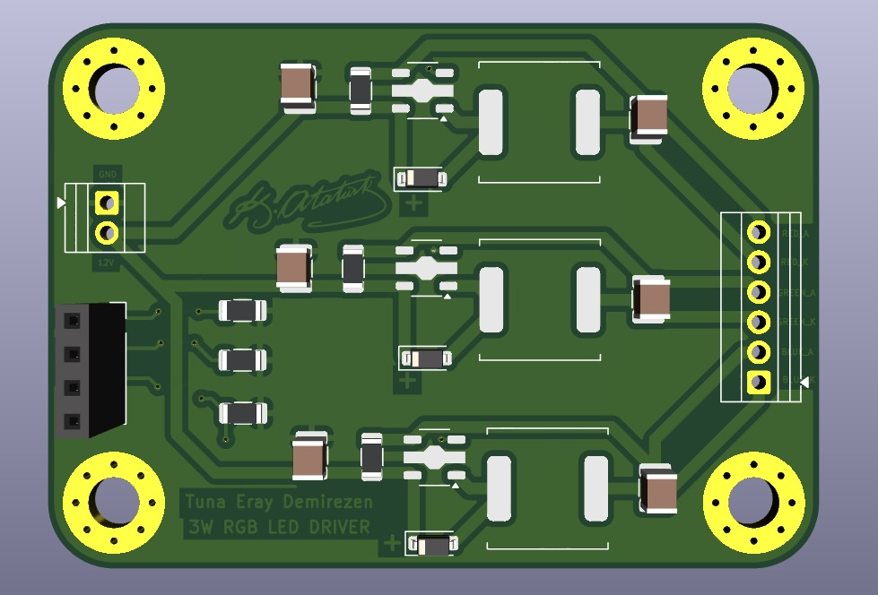
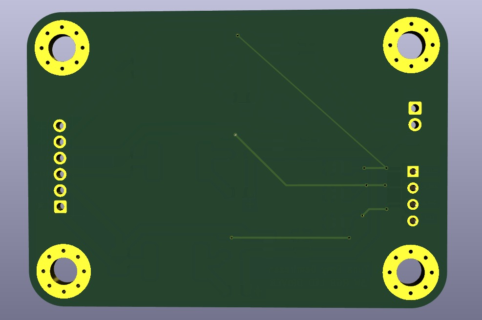
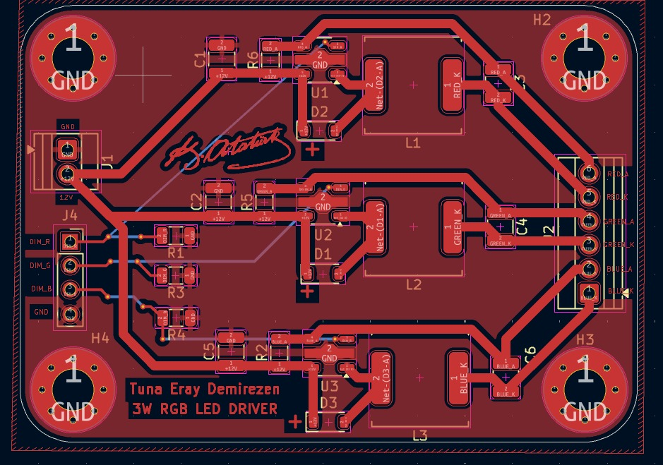

# 3W RGB LED Driver

A custom-designed 3W RGB LED driver board with PWM dimming capability, developed for an Autonomous Underwater Vehicle (AUV).

## Overview

This board was designed to control the color output of a 3W RGB LED by adjusting each channel independently via PWM signals. The primary purpose is to assist the AUV's image processing system in object detection by providing tunable, high-intensity illumination underwater.

## Features

- 3W RGB LED driving capability
- - Independent PWM dimming for R, G and B channels
  - - Designed for underwater environments (AUV integration)
    - - Enables color-based object detection for computer vision tasks
     
      - ## Use Case
     
      - Underwater visibility is limited and colors shift significantly with depth. By dynamically adjusting the LED color via PWM, the AUV's camera can capture more accurate color data, improving the reliability of the image processing and object detection algorithms.
      - 

## Images

### PCB Front

### PCB Back

### PCB Layout

